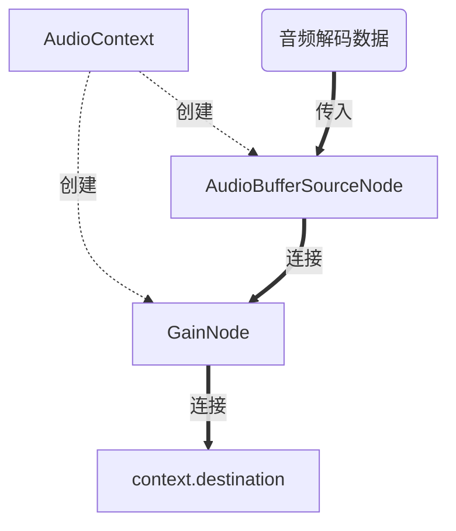

Electron 开发笔记整理 10
===
#Electron #代码笔记 

---

> 整蛊了，国庆节放假回来完全断更，不过也在做新的尝试，就是没码到博文。复建一下

  
好吧，这次就给前面几篇笔记做个收尾，同时也说下我断更这一个月做的新项目，同样也是对我以前的项目做个补足。
  
## 旧项目的回顾和存档

1. **sqlite 的初始化问题。**
  
在我现在做的这个新项目中用了一个新办法来判断 sqlite 的创建问题
  
```ts
export function procdb() {
    const { checkFilePath, createFile } = useUtil()
    const filepath = join(app.getPath('exe'),'../', 'basedb.sqlite3')
    const pathflag = fs.existsSync(filepath)
    if (!pathflag) fs.openSync(filepath, 'w')
    const resPath = relative(__dirname, filepath)
    db.setdbPath(resPath)
    // ...
}
```

2. **如何更好的去创建工程目录？**
  
目的是为了降耦合，提高复用。但我写爽了就完全忘了有这一回事了。
像是防抖和正则提取可以放到 util 类目中，写逻辑单独放在 service 目录，装载监听放在 loder 目录，types 就集中放变量定义。后面如果说要做网络通信还得要单独抽一层 API 目录做 api 调用。
  
## 新项目的挖坑和实践

这个是一个大坑，但是好在成功实现了主要功能了，也不算差。代码已经传上 github 了。
  
具体的效果是这样的
  

![[../../static/2023-11-02-21-33-45.gif]]

  
这个玩具具体来说主要是 2 个主要模块，文件索引存储和音频模块的实现。
  
文件索引依靠 nodejs 的文件读取模块（fs）来储存音频文件的元数据，主要目的是获取文件路径索引以此能传入到音频模块进行解码。
  
文件索引用的数据库依然采用了之前的 sqlite-electron ，如果不用的话用 better-sqlite 下载的话加个 .npmrc ，设置镜像下载源下可以无缝下载。 
  
音频模块主要依靠 MDN 介绍到的 WEB AUDIO API 来进行一个实践应用。目的是对标一个标准音频播放器的基本操作。前进，后退，暂停和播放，音频条，音响条，随机/顺序播放，和播放队列。
  
真正困难的是音频条实现，但好在有 MDN 官方文档的案例做参考学习。  

具体来说，就是这样：  



> [!Warning] 注意
> 此为最小实现模型，省略了非常多的细节，具体参考 MDN 文档

audiocontext 是负责创建一个音频工作环境的类，可以理解为工作区
buffersourcenode 是负责加载生成的音频解码数据，数据通过读取文件url来生成解码后的元数据。然后再传递到下一个节点。  
gainnode 是负责音量控制的节点，通过这个节点的控制来调节音量大小  
最后，就是音频输出到外部扬声器，调用 context.destination 让系统判断默认的扬声器并输出音频  

mdn 的做法是以类的方式来创建一个音频工作区，并在类里通过设置一个定时器来循环获取当前音频长度。  
  
**题外话**  
最近在研究 nestjs 和自动化部署相关的内容，主要是自动化。目的对公司上的老项目进行自动化测试的实现。  
  
就这样吧，小水一下内容，也不多